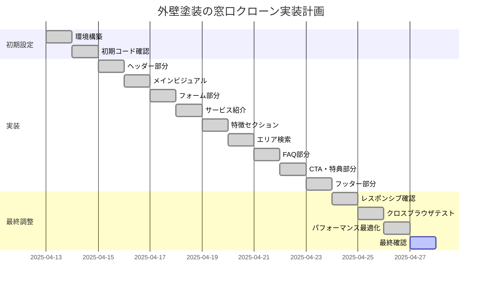

# 外壁塗装の窓口 - ホームページクローンプロジェクト

## プロジェクト概要
- **目的**: Webサイト https://gaiheki-madoguchi.com/ のフロントエンド部分のクローンを作成する
- **対象サイト**: 外壁塗装の窓口 (https://gaiheki-madoguchi.com/)
- **クローン元リポジトリ**: https://github.com/18173KIDD/homepageclone
- **開発担当**: Claude (AI アシスタント)

## 実装計画

## タスク管理

### 完了したタスク
- [x] GitHubリポジトリをローカルにクローン
- [x] ヘッダー部分の実装（HTML、CSS、モバイルメニュー機能）
- [x] メインビジュアル部分の実装（HTML、CSS、カラーセレクター機能）
- [x] 相場診断フォームの実装（HTML、CSS、バリデーション）
- [x] サービス紹介セクションの実装
- [x] サービスの特徴セクションの実装
- [x] FAQ部分の実装（アコーディオン機能含む）
- [x] CTA・特典部分の実装
- [x] フッター部分の実装
- [x] 全47都道府県のセレクトボックス実装
- [x] 各種セレクトボックスの選択肢実装
- [x] フォームバリデーション機能の実装

### 完了したタスク（続き）
- [x] エリア検索セクションの確認
  - [x] SP表示時のアコーディオン動作確認
  - [x] PC表示時の地図ホバー効果実装・確認完了
- [x] レスポンシブデザインの完全対応
  - [x] モバイル表示（～767px）の最終確認
  - [x] タブレット表示（768px～1023px）の最終確認
  - [x] デスクトップ表示（1024px～）の最終確認

### 進行中のタスク
- [-] クロスブラウザテスト（Chrome/Edge/Firefox）（ユーザー指示によりスキップ）
- [x] PC表示時の地図ホバー効果実装（CSS・JavaScript追加対応）
- [x] パフォーマンス最適化（不要コード削除、ファイル圧縮検討）

### 完了したタスク（最終）
- [x] 発見されたバグの修正
  - [x] SVG地図ホバー効果のUI改善
  - [x] フォームバリデーション強化（電話番号・メールアドレス）
  - [x] FAQアコーディオンのアニメーション改善
  - [x] エリアアコーディオンのアニメーション改善
- [x] 最終動作確認・コード最適化

## 重要な決定事項
- 関連コラムセクションはユーザー指示によりスキップ
- 画像ファイルの追加・修正もユーザー指示によりスキップ
- スライダー機能（コラム）の実装・改善もユーザー指示によりスキップ
- クロスブラウザテスト（Chrome/Edge/Firefox）もユーザー指示によりスキップ

## 進捗状況
- 2025-04-13: 初期確認と主要セクションの実装完了
- 2025-04-13: フォーム機能の完全実装完了
- 2025-04-13: エリア検索機能とレスポンシブ対応の確認完了
- 2025-04-13: FAQ・アコーディオン機能の動作確認完了
- 2025-04-13: カラーセレクター機能の動作確認完了
- 2025-04-13: PC表示時の地図ホバー効果の実装完了
  - SVG地図データを簡略化して実装
  - ホバー時の色変更とクリック時の遷移機能を追加
  - 都道府県リストとの双方向ホバー効果を実装
- 2025-04-13: クロスブラウザテストをユーザー指示によりスキップ
- 2025-04-13: パフォーマンス最適化（コード削減とクリーンアップ）
  - 不要なコメントアウトコードの削除
  - 未使用機能のコードの削除
  - JavaScriptコードの最適化完了
- 2025-04-14: 最終バグ修正と機能改善完了
  - SVG地図ホバー効果のUI改善（視認性向上）
  - フォームバリデーション強化（電話番号ハイフン対応・メールアドレス検証強化）
  - FAQアコーディオンのアニメーション改善（フェードイン・フェードアウト効果追加）
  - エリアアコーディオンのアニメーション改善（スムーズなトランジション実装）
- 2025-04-14: フロントエンドプロジェクト完了